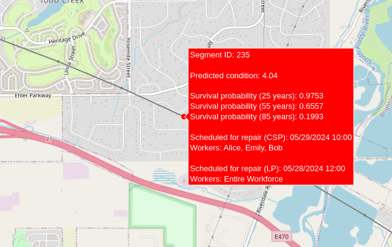

# Water Main Prognosis
An AI-driven project to simplify the preventative management of water main segments. We focus on two main components: prediction of health scores for pipe segments and the optimized scheduling of repairs.



## Project Organization

Use Python version >= 3.8 and run `pip install -r requirements.txt`.

```
├── data/    # Our datasets stored in csv format
├── graphs/  # SA and ML graphs
├── map/     # Demo map generation
├── models/  # ML models
├── prediction_and_survival/  # SA
├── research/   # SA and ML notebooks
├── scheduler/  # CSP and LP schedulers
```

## Task schedulers
- `/scheduler/workforce.py` defines employees with work hours and tasks to be scheduled
- The output of the scheduling tasks are interactive gantt charts that open in a new browser window

### Constraint Satisfaction Problem
- `/scheduler/CSP/main.py` solves the scheduling problem using backtracking
- `/scheduler/CSP/csp.py` contains the constraints

### Linear Programming
- `/scheduler/LP/main.py` solves the scheduling problem using pulp's linear programming capabilities
